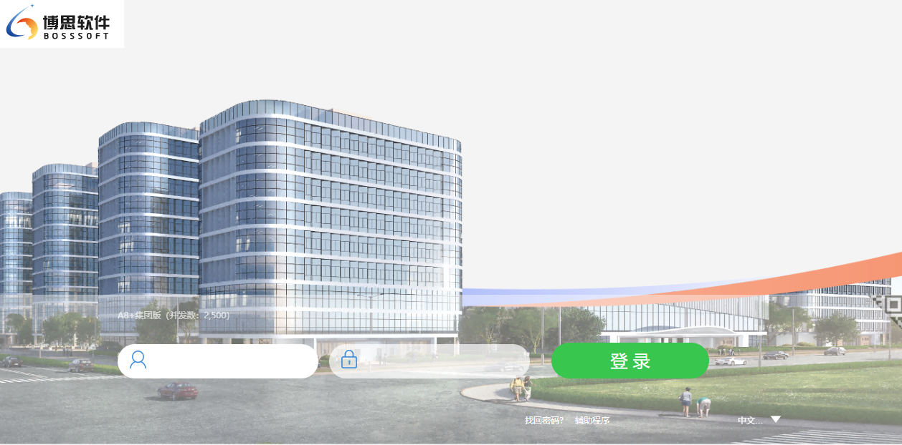

# Seeyon A8+ 登录页面详细分析文档

## 1. 网站概述

| 属性    | 值                                         |
| ----- | ----------------------------------------- |
| 网站名称  | 博思软件项目管理系统                                |
| 产品类型  | Seeyon A8+集团版                             |
| 版本    | V8.1SP2                                   |
| 并发数   | 2,500                                     |
| 访问URL | `http://120.35.0.67:28101/seeyon/main.do` |
| 上下文路径 | `/seeyon`                                 |
| 服务器地址 | `http://120.35.0.67:28101/seeyon`         |
| 当前语言  | 中文（简体）                                    |

***

## 2. 页面结构分析

### 2.0 页面截图



### 2.1 整体布局

页面采用 **上下布局（t\_b）**，主要包含以下区域：

```
┌─────────────────────────────────────────────────────────────┐
│                     顶部Logo区域                             │
│  (login_logo - fileId=8813319586997813691)                  │
├─────────────────────────────────────────────────────────────┤
│                     背景轮播图                               │
│  (login_bg - slideBox)                                      │
├─────────────────────────────────────────────────────────────┤
│                     登录表单区域                             │
│  ┌─────────────────────────────────────────────────────┐    │
│  │ 用户名输入框 + 密码输入框 + 登录按钮                   │    │
│  ├─────────────────────────────────────────────────────┤    │
│  │ 找回密码 | 辅助程序 | 语言选择                       │    │
│  └─────────────────────────────────────────────────────┘    │
├─────────────────────────────────────────────────────────────┤
│                     二维码登录弹窗（隐藏）                     │
│  (QrcodeArea)                                               │
└─────────────────────────────────────────────────────────────┘
```

### 2.2 核心DOM元素

#### 2.2.1 表单元素

| 元素ID                        | 类型     | Name属性                     | 用途                                          |
| --------------------------- | ------ | -------------------------- | ------------------------------------------- |
| `login_form`                | form   | loginform                  | 登录表单容器，POST到 `/seeyon/main.do?method=login` |
| `login_username`            | input  | login\_username            | 用户名输入框                                      |
| `login_password1`           | input  | login\_password1           | 密码输入框（明文），autocomplete="off"                |
| `login_password`            | hidden | login\_password            | DES加密后的密码（运行时生成）                            |
| `login_button`              | button | -                          | 登录按钮，触发 `loginButtonOnClickHandler()`       |
| `submit_button`             | submit | -                          | 实际提交按钮（隐藏）                                  |
| `login_validatePwdStrength` | hidden | login\_validatePwdStrength | 密码强度校验级别（值为4）                               |

#### 2.2.2 隐藏字段

| 元素ID                         | 用途             |
| ---------------------------- | -------------- |
| `authorization`              | 授权信息           |
| `timezone`                   | 时区信息（登录时自动填充）  |
| `province`                   | 省份（通过高德IP定位获取） |
| `city`                       | 城市（通过高德IP定位获取） |
| `rectangle`                  | 地理矩形范围         |
| `redirect_url`               | 登录后重定向URL      |
| `token_login_app_id`         | Token登录应用ID    |
| `token_login_third_user_id`  | Token登录第三方用户ID |
| `request_auth_authenticator` | 请求认证器          |
| `random`                     | 二维码登录随机数       |
| `trustdo_type`               | 信任类型（用于手机盾）    |

#### 2.2.3 UI元素

| 元素ID             | 用途               |
| ---------------- | ---------------- |
| `login_error`    | 登录错误提示区域         |
| `phone_error`    | 短信验证码错误提示区域      |
| `login_locale`   | 语言选择下拉框          |
| `login_text_div` | 系统版本信息显示（A8+集团版） |
| `qrcodeArea`     | 二维码登录入口（默认隐藏）    |
| `QrcodeArea`     | 二维码登录弹窗          |
| `login_logo`     | 顶部Logo           |
| `login_bg`       | 背景轮播图容器          |

### 2.3 登录模式切换

页面支持多种登录模式，通过DOM显示/隐藏控制：

| 模式       | 容器ID               | 默认状态 | 触发方式  |
| -------- | ------------------ | ---- | ----- |
| 用户名密码登录  | `showAccountLogin` | 显示   | 默认    |
| 手机号验证码登录 | `showPhoneLogin`   | 隐藏   | 切换按钮  |
| 二维码登录    | `QrcodeArea`       | 隐藏   | 二维码按钮 |

***

## 3. 关键JavaScript函数分析

### 3.1 函数清单

#### 3.1.1 核心登录流程函数

| 函数名                           | 功能描述                          | 调用链位置     |
| ----------------------------- | ----------------------------- | --------- |
| `loginButtonOnClickHandler()` | 登录按钮点击入口，处理加密种子校验、时区设置、登录模式判断 | 按钮onclick |
| `onLoginSubmit()`             | 登录提交预处理，执行密码DES加密，收集屏幕信息      | 表单submit  |
| `doLoginSubmit()`             | 执行表单提交（点击隐藏submit按钮）          | 登录流程      |
| `doAjaxLogin()`               | AJAX方式登录，异步提交表单数据             | 登录流程      |
| `loginButtonClick()`          | 防重复提交封装                       | 回车键触发     |

#### 3.1.2 安全机制函数

| 函数名                          | 功能描述            |
| ---------------------------- | --------------- |
| `UpdateLoginSeed()`          | 更新登录加密种子，超时自动刷新 |
| `getPwdStrongForLoginPage()` | 密码强度校验          |

#### 3.1.3 二维码登录函数

| 函数名                 | 功能描述       |
| ------------------- | ---------- |
| `loginForWechat()`  | 微信扫码登录状态轮询 |
| `intervalLogin()`   | 轮询定时器回调    |
| `changeLoginMode()` | 切换到二维码登录模式 |
| `showQrcodeArea()`  | 显示二维码登录弹窗  |
| `hideQrcodeArea()`  | 隐藏二维码登录弹窗  |
| `showPrevQRPage()`  | 切换上一页二维码   |
| `showNextQRPage()`  | 切换下一页二维码   |

#### 3.1.4 辅助功能函数

| 函数名                             | 功能描述           |
| ------------------------------- | -------------- |
| `retrievePassword()`            | 找回密码功能入口       |
| `setCurrentCity()`              | 高德地图IP定位回调     |
| `changeCssAndLoadJsByTrustdo()` | 手机盾样式切换        |
| `utf16to8()`                    | UTF-16转UTF-8编码 |
| `sendBroadcast()`               | 跨页面广播通信        |

### 3.2 核心函数详细分析

#### 3.2.1 `loginButtonOnClickHandler()` - 登录入口

**功能**：登录按钮点击的主入口函数，负责：

1. 加密种子超时校验与更新
2. 时区信息获取与设置
3. 判断登录模式（用户名密码/短信验证码/二维码）

**关键逻辑**：

```
1. 加密种子超时校验
   - 默认超时时间：30分钟
   - 提前1分钟到期校验
   - 超时则调用 UpdateLoginSeed()

2. 时区设置
   - 调用 getTimeZoneId() 获取时区
   - 设置到隐藏字段 #timezone

3. 登录模式判断
   - 无用户名且非手机号登录 → 直接提交
   - 有用户名 → 判断是否需要短信验证码
   - 二维码登录中 → 直接提交
```

**超时校验代码逻辑**：

```javascript
var SeedTimeOutInSeconds = 60 * 30; // 默认30分钟
if (_SecuritySeedTimeOut !== "") {
    SeedTimeOutInSeconds = parseInt(_SecuritySeedTimeOut);
}
if (SeedTimeOutInSeconds > 60) {
    SeedTimeOutInSeconds = SeedTimeOutInSeconds - 60; // 提前1分钟
}
if (_SecuritySeed !== "" && leaveTime - entryTime > SeedTimeOutInSeconds * 1000) {
    UpdateLoginSeed();
}
```

***

#### 3.2.2 `onLoginSubmit()` - 密码加密与表单预处理

**功能**：登录表单提交前的核心处理函数，负责：

1. 禁用登录按钮防止重复提交
2. 收集客户端屏幕信息（fontSize、screenWidth、screenHeight）
3. 使用DES算法加密密码
4. 设置全局加密密码变量

**密码加密流程**：

```
用户输入明文密码 → CryptoJS.enc.Utf8.parse() → CryptoJS.DES.encrypt() → 加密结果
                          ↓
                    使用 _SecuritySeed 作为密钥
                          ↓
              结果存入隐藏字段 #login_password
              同时存入全局变量 encryptedLoginPassword
```

**加密代码逻辑**：

```javascript
if ($("#login_password1").val() != "") {
    var us = CryptoJS.enc.Utf8.parse($("#login_password1").val());
    var encrypted = CryptoJS.DES.encrypt(us, _SecuritySeed);
    $("#login_password-wrapper").append(
        "<input type='hidden' id='login_password' name='login_password' value='" + encrypted + "' />"
    );
    getCtpTop().encryptedLoginPassword = encrypted.toString();
}
```

**设计要点**：

- 使用 CryptoJS DES 算法进行对称加密
- 密钥 `_SecuritySeed` 由服务端下发（当前值：`427192484`）
- 加密结果同时存入DOM和全局变量，防止浏览器自动填充导致赋值失败

***

#### 3.2.3 `doAjaxLogin()` - AJAX登录提交

**功能**：通过AJAX方式提交登录请求，异步获取登录结果

**请求参数**：

| 参数名                   | 来源                            | 说明                |
| --------------------- | ----------------------------- | ----------------- |
| `login_username`      | `#login_username`             | 用户名               |
| `login_password`      | 全局变量 `encryptedLoginPassword` | DES加密后的密码         |
| `loginFrom`           | 硬编码                           | 固定值 "loginPortal" |
| `login.timezone`      | `#timezone`                   | 时区ID              |
| `login.smsVerifyCode` | `#smsVerifyCode`              | 短信验证码             |
| `login.VerifyCode`    | `#VerifyCode`                 | 图形验证码             |
| `province`            | `#province`                   | 省份（IP定位）          |
| `city`                | `#city`                       | 城市（IP定位）          |
| `rectangle`           | `#rectangle`                  | 地理矩形范围            |

**响应处理**：

| 响应内容        | 处理方式                              |
| ----------- | --------------------------------- |
| 包含 "ok"     | 跳转至 `/seeyon/indexOpenWindow.jsp` |
| 包含 "0;url=" | 登录失败，提示并重新加载页面                    |
| 其他（长度<100）  | 直接alert显示错误信息                     |
| 其他          | 重新加载登录页面                          |

***

#### 3.2.4 `UpdateLoginSeed()` - 加密种子更新

**功能**：定期更新登录加密种子，保证安全性

**请求方式**：GET `/seeyon/main.do?method=updateLoginSeed`

**响应处理**：

- 如果返回新种子与当前种子不同，则更新 `_SecuritySeed`
- 同步请求（async: false），确保种子更新完成后再进行登录

***

#### 3.2.5 `loginForWechat()` - 微信二维码登录

**功能**：轮询检查微信扫码登录状态

**请求方式**：GET `/seeyon/main.do?method=login4QrCode&random={random}`

**响应处理**：

- 返回非 "loginError" 且非空 → 设置用户名并触发登录
- 返回 "loginError" → 设置 `sendFlag = true`，继续轮询

**轮询机制**：

- 通过 `setInterval("intervalLogin()", 1000)` 每秒轮询一次
- `intervalLogin()` 检查 `sendFlag`，为true时调用 `loginForWechat()`

***

#### 3.2.6 `retrievePassword()` - 找回密码

**功能**：找回密码功能入口，先检查功能是否可用

**请求方式**：POST `/seeyon/personalBind.do?method=isCanUse`

**响应处理**：

- 返回 true → 打开找回密码页面 `/seeyon/personalBind.do?method=retrievePassword`
- 返回 false → 提示管理员未配置邮箱或短信插件

***

## 4. 安全机制分析

### 4.1 密码加密机制

| 项目     | 描述                          |
| ------ | --------------------------- |
| 加密算法   | CryptoJS DES                |
| 密钥来源   | 服务端下发（`_SecuritySeed`）      |
| 当前密钥值  | `427192484`                 |
| 密钥超时时间 | 默认3600秒（1小时）                |
| 密钥更新方式 | `UpdateLoginSeed()` 异步获取新密钥 |

### 4.2 防重复提交

```javascript
var submitCount = 0;
function loginButtonClick() {
    if (submitCount == 0) {
        submitCount++;
        $("#login_button").click();
    }
}
```

通过 `submitCount` 变量确保登录请求只提交一次。

### 4.3 客户端信息收集

登录时收集以下客户端信息，用于安全审计：

| 字段             | 来源                     | 用途      |
| -------------- | ---------------------- | ------- |
| `fontSize`     | 计算值（固定12）              | 客户端显示环境 |
| `screenWidth`  | `window.screen.width`  | 屏幕分辨率   |
| `screenHeight` | `window.screen.height` | 屏幕分辨率   |
| `timezone`     | `getTimeZoneId()`      | 时区信息    |
| `province`     | 高德IP定位                 | 地理位置    |
| `city`         | 高德IP定位                 | 地理位置    |

### 4.4 自动填充防护

```html
<input id="login_password1" autocomplete="off" ...>
```

密码输入框设置 `autocomplete="off"` 防止浏览器自动填充，避免明文密码泄露。

### 4.5 加密种子轮换

```javascript
// 登录按钮点击时检查种子是否过期
if (_SecuritySeed !== "" && leaveTime - entryTime > SeedTimeOutInSeconds * 1000) {
    UpdateLoginSeed();
}
```

加密种子具有时效性，超时后自动从服务端获取新种子，增强安全性。

***

## 5. 后端API端点汇总

### 5.1 登录相关接口

| API路径                                    | HTTP方法 | 功能描述       |
| ---------------------------------------- | ------ | ---------- |
| `/seeyon/main.do?method=login`           | POST   | 用户登录（核心接口） |
| `/seeyon/main.do?method=login4QrCode`    | GET    | 二维码登录状态轮询  |
| `/seeyon/main.do?method=updateLoginSeed` | GET    | 更新加密种子     |
| `/seeyon/main.do?method=changeLocale`    | POST   | 切换语言       |
| `/seeyon/main.do?method=qrCodeHelp`      | GET    | 二维码登录帮助页面  |

### 5.2 辅助功能接口

| API路径                                             | HTTP方法 | 功能描述         |
| ------------------------------------------------- | ------ | ------------ |
| `/seeyon/personalBind.do?method=isCanUse`         | POST   | 检查找回密码功能是否可用 |
| `/seeyon/personalBind.do?method=retrievePassword` | GET    | 找回密码页面       |
| `/seeyon/fileUpload.do?method=showRTE`            | GET    | 文件/图片展示      |

### 5.3 外部服务接口

| API路径                                                                 | HTTP方法 | 功能描述     |
| --------------------------------------------------------------------- | ------ | -------- |
| `https://restapi.amap.com/v3/ip?key=303e24733ada73ca23760ac77f19701b` | GET    | 高德地图IP定位 |
| `https://weixin.seeyon.com/mobilehelp.jsp`                            | GET    | 微信扫码登录   |
| `https://weixin.seeyon.com/corpAccount/wechatQrLogin`                 | GET    | 企业微信扫码登录 |

### 5.4 静态资源路径

| 路径                                             | 类型         | 说明                       |
| ---------------------------------------------- | ---------- | ------------------------ |
| `/seeyon/common/all-min.js`                    | JavaScript | 核心JS库（含jQuery、CryptoJS等） |
| `/seeyon/common/all-min.css`                   | CSS        | 核心样式                     |
| `/seeyon/main/login/default/css/login.css`     | CSS        | 登录页样式                    |
| `/seeyon/common/js/crypto.js`                  | JavaScript | 加密库                      |
| `/seeyon/common/js/jquery.qrcode.min.js`       | JavaScript | 二维码生成                    |
| `/seeyon/apps_res/phoneLogin/js/phoneLogin.js` | JavaScript | 手机号登录模块                  |
| `/seeyon/common/ctpUi/dist/js/ctpUi.js`        | JavaScript | UI组件库                    |
| `/seeyon/i18n_init_zh_CN.js`                   | JavaScript | 国际化资源（中文）                |

***

## 6. 登录流程详解

### 6.1 用户名密码登录流程

```
用户输入用户名密码
        ↓
点击登录按钮 / 按回车键
        ↓
loginButtonOnClickHandler()
        ↓
┌──────────────────────┐
│ 加密种子超时校验      │
│ >30分钟则调用         │
│ UpdateLoginSeed()    │
└──────────────────────┘
        ↓
设置时区信息（getTimeZoneId()）
        ↓
判断登录模式
        ↓
┌──────────────────────┐
│ 需要短信验证码？      │
│ 是 → 校验验证码       │
│ 否 → 继续            │
└──────────────────────┘
        ↓
doLoginSubmit() / doAjaxLogin()
        ↓
onLoginSubmit()
        ↓
┌──────────────────────┐
│ DES加密密码          │
│ 收集屏幕信息          │
│ 设置隐藏字段          │
└──────────────────────┘
        ↓
POST /seeyon/main.do?method=login
        ↓
┌──────────────────────┐
│ 响应包含"ok"         │
│ → 跳转 indexOpenWindow.jsp │
│ 其他 → 显示错误信息   │
└──────────────────────┘
```

### 6.2 二维码登录流程

```
用户点击二维码登录按钮
        ↓
changeLoginMode()
        ↓
显示二维码弹窗（QrcodeArea）
        ↓
生成随机数 random
        ↓
生成二维码图片（微信/企业微信/手机盾）
        ↓
loginForWechat() 开始轮询
        ↓
每1秒调用 intervalLogin()
        ↓
GET /main.do?method=login4QrCode&random={random}
        ↓
┌──────────────────────┐
│ 返回用户名           │
│ → 设置用户名并登录   │
│ 返回loginError      │
│ → 继续轮询           │
└──────────────────────┘
```

### 6.3 手机号验证码登录流程

```
切换到手机号登录模式
        ↓
输入手机号
        ↓
点击"获取验证码"
        ↓
getMessageCode() 发送短信
        ↓
输入验证码
        ↓
点击登录按钮
        ↓
loginButtonOnClickHandler()
        ↓
校验验证码有效性
        ↓
doLoginSubmit()
        ↓
POST登录请求（含手机号和验证码）
```

***

## 7. 技术栈分析

### 7.1 前端框架与库

| 技术            | 版本 | 用途                |
| ------------- | -- | ----------------- |
| jQuery        | 内置 | DOM操作、AJAX请求、事件处理 |
| CryptoJS      | -  | DES密码加密           |
| jquery.qrcode | -  | 二维码生成             |
| ctpUi         | -  | 自定义UI组件库          |
| syIconfont    | -  | 图标字体              |

### 7.2 自定义jQuery扩展

| 扩展方法              | 用途       |
| ----------------- | -------- |
| `$.dropdown()`    | 下拉选择组件   |
| `$.progressBar()` | 进度条组件    |
| `$.messageBox()`  | 消息弹窗组件   |
| `$.fillOption()`  | 填充下拉选项   |
| `$.i18n()`        | 国际化翻译    |
| `$.formobj()`     | 表单序列化    |
| `$.jsonSubmit()`  | JSON表单提交 |

### 7.3 全局变量

| 变量名                    | 当前值                               | 用途        |
| ---------------------- | --------------------------------- | --------- |
| `CSRFTOKEN`            | `null`                            | CSRF令牌    |
| `_ctxPath`             | `/seeyon`                         | 上下文路径     |
| `_ctxServer`           | `http://120.35.0.67:28101/seeyon` | 服务器地址     |
| `_locale`              | `zh_CN`                           | 当前语言      |
| `_SecuritySeed`        | `427192484`                       | DES加密密钥   |
| `_SecuritySeedTimeOut` | `3600`                            | 密钥超时时间（秒） |
| `seeyonProductId`      | `2`                               | 产品ID      |
| `wechatCorpUrl`        | 企业微信URL                           | 企业微信扫码地址  |

***

## 8. 国际化支持

### 8.1 支持语言

| 语言代码    | 显示名称    |
| ------- | ------- |
| `zh_CN` | 中文（简体）  |
| `zh_TW` | 中文（繁體）  |
| `en`    | English |

### 8.2 语言切换机制

```javascript
var _dropdownObj = $.dropdown({
    id: 'login_locale',
    onchange: function() {
        $("#login_locale").jsonSubmit({
            action: _ctxPath + '/main.do?method=changeLocale'
        });
    }
});
```

语言切换通过POST请求到 `/main.do?method=changeLocale` 实现，页面会重新加载以应用新语言。

***

## 9. 配置与定制化

### 9.1 热区配置（HotSpots）

页面通过热区配置实现高度定制化，主要配置项包括：

| 配置项    | Key                 | 说明                               |
| ------ | ------------------- | -------------------------------- |
| 登录框位置  | `loginboxposition`  | 控制登录框在页面中的位置                     |
| 登录框背景色 | `loginboxmainbgc`   | 登录框主背景色（当前rgba(255,255,255,0.4)） |
| 登录按钮颜色 | `loginboxbuttonbgc` | 登录按钮背景色（当前rgb(56,198,78)）        |
| 背景图片   | `changebgi`         | 轮播背景图片列表                         |
| 布局类型   | `layout`            | 页面布局（t\_b上下布局）                   |
| 二维码显示  | `showQr`            | 是否显示二维码登录入口                      |
| 系统名称   | `note`              | 系统标题（博思软件项目管理系统）                 |

### 9.2 模板配置

```javascript
$.ctx.template = {
    "id": "8663751873741276919",
    "preset": 1,
    "name": "登录页模板二",
    "path": "default/login.jsp"
};
```

当前使用的是"登录页模板二"，路径为 `default/login.jsp`。

***

## 10. 页面加载时序

```
页面加载开始
        ↓
加载CSS资源（all-min.css, login.css, ctpUi.css）
        ↓
加载JavaScript资源
        ↓
┌──────────────────────┐
│ all-min.js           │
│ ajaxStub.js          │
│ crypto.js            │
│ jquery.qrcode.min.js │
│ i18n_init_zh_CN.js   │
│ passwdcheck.js       │
│ phoneLogin.js        │
│ ctpUi.js             │
└──────────────────────┘
        ↓
执行内联JavaScript（全局变量、函数定义）
        ↓
触发 onload="calSelecterHeight()"
        ↓
执行 jQuery $(function() {...}) 初始化
        ↓
┌──────────────────────┐
│ 初始化表单           │
│ 清空用户名密码输入框  │
│ 禁用密码自动填充      │
│ 初始化语言选择器      │
│ 绑定表单提交事件      │
│ 绑定回车键事件        │
│ 设置登录回调          │
└──────────────────────┘
        ↓
获取IP定位信息（高德API）
        ↓
页面加载完成，等待用户操作
```

***

## 11. 潜在安全风险分析

### 11.1 密码加密强度

- **风险等级**：中
- **问题描述**：使用DES算法进行密码加密，DES为过时算法，密钥长度仅56位，存在被暴力破解风险
- **建议**：升级为AES-256加密算法

### 11.2 加密种子传输

- **风险等级**：低
- **问题描述**：`UpdateLoginSeed()` 使用GET请求传输加密种子，种子可能被日志记录
- **建议**：改用POST请求，并对传输过程进行加密

### 11.3 客户端信息收集

- **风险等级**：低
- **问题描述**：收集用户地理位置信息（省份、城市），可能涉及隐私合规问题
- **建议**：确保用户知情并同意数据收集

### 11.4 二维码登录随机数

- **风险等级**：低
- **问题描述**：随机数使用 `Math.uuid()` 生成，依赖客户端随机数生成器
- **建议**：使用服务端生成的安全随机数

***

## 12. 总结

本登录页面是Seeyon A8+ V8.1SP2集团版的标准登录界面，具备以下特点：

1. **多登录模式支持**：用户名密码、手机号验证码、微信/企业微信/手机盾二维码登录
2. **安全机制完善**：DES密码加密、加密种子轮换、防重复提交、客户端信息收集
3. **高度定制化**：通过热区配置和模板系统实现页面样式的灵活定制
4. **国际化支持**：支持中文简体、繁体和英文三种语言
5. **技术栈成熟**：基于jQuery的传统Web开发模式，兼容性良好

页面设计兼顾了安全性和用户体验，登录流程清晰，错误处理完善，是一个典型的企业级OA系统登录页面。
