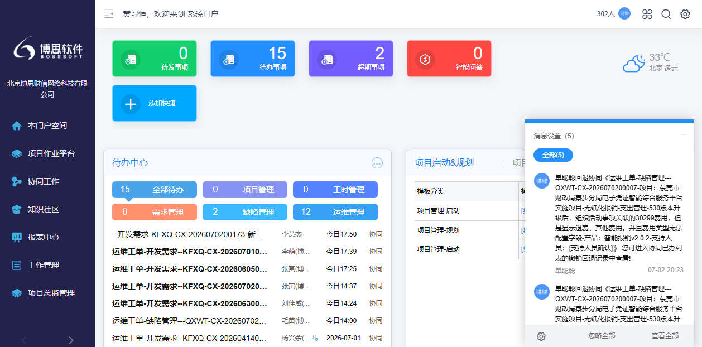

# Seeyon A8+ 主应用页面详细分析文档

## 1. 页面概述

| 属性 | 值 |
|------|-----|
| 页面名称 | 博思软件项目管理系统 - 主应用页面 |
| 访问URL | `http://120.35.0.67:28101/seeyon/main.do?method=main` |
| 登录用户 | 黄习恒 |
| 当前空间 | 个人空间 |
| 所属单位 | 北京博思财信网络科技有限公司 |

---

## 2. 页面整体布局

### 2.1 布局架构

页面采用经典的 **三栏布局** 结构：

```
┌─────────────────────────────────────────────────────────────────────────┐
│                         顶部操作区 (seeyonPortalHeader)                 │
│  [收起] [欢迎语] [在线人数] [头像] [应用中心] [搜索] [设置] [退出]      │
├────────────────────┬────────────────────────────────────────────────────┤
│                    │                                                    │
│   左侧导航栏        │                    主内容区                         │
│  (seeyonPortalLeft)│                 (seeyonPortalBody)                │
│                    │                                                    │
│  ┌───────────────┐ │  ┌──────────────────────────────────────────────┐  │
│  │   Logo & 单位 │ │  │  快捷入口: 待发/待办/超期/智能问答          │  │
│  ├───────────────┤ │  ├──────────────────────────────────────────────┤  │
│  │   本门户空间  │ │  │  待办中心: 全部待办/项目管理/工时管理/...    │  │
│  ├───────────────┤ │  ├──────────────────────────────────────────────┤  │
│  │   项目作业平台│ │  │  待办列表: 标题/发送人/时间/类型             │  │
│  ├───────────────┤ │  ├──────────────────────────────────────────────┤  │
│  │   协同工作    │ │  │  右侧栏: 天气信息                          │  │
│  ├───────────────┤ │  └──────────────────────────────────────────────┘  │
│  │   知识社区    │ │                                                    │
│  ├───────────────┤ │                                                    │
│  │   报表中心    │ │                                                    │
│  ├───────────────┤ │                                                    │
│  │   工作管理    │ │                                                    │
│  ├───────────────┤ │                                                    │
│  │   项目总监管理│ │                                                    │
│  └───────────────┘ │                                                    │
│                    │                                                    │
└────────────────────┴────────────────────────────────────────────────────┘
```

### 2.2 页面截图



---

## 3. 左侧导航栏分析

### 3.1 导航结构

左侧导航栏采用 **三级菜单结构**（lev1 → lev2 → lev3）：

| 一级菜单 | 二级菜单 | 三级菜单（部分） |
|----------|----------|------------------|
| 本门户空间 | 个人空间 | - |
| | 智能问答正式 | - |
| | 单位空间 | - |
| 项目作业平台 | 项目实施作业平台 | - |
| 协同工作 | 待发事项 | - |
| | 已发事项 | - |
| | 待办事项 | - |
| | 已办事项 | - |
| 知识社区 | 知识门户 | - |
| | 文档中心 | - |
| | 我的收藏 | - |
| 报表中心 | 报表分析 | - |
| 工作管理 | [填写]项目周报-医疗智慧财务 | - |
| | [填写]个人工作日报 | - |
| | [查询]个人工作日报 | - |
| | [填写]个人工作周报 | - |
| | [查询]个人工作周报 | - |
| | [填写]项目周报 | - |
| 项目总监管理 | 管理档案 | 【项目总监】项目档案 |
| | | 【项目总监】计划编制 |
| | | 【项目总监】任务档案 |
| | | 【项目总监】工时档案 |

### 3.2 导航功能说明

#### 3.2.1 门户空间切换

| 空间名称 | 图标 | 功能说明 |
|----------|------|----------|
| 个人空间 | vp-menu_personal | 用户个人工作空间，包含个人待办、文档等 |
| 智能问答正式 | vp-menu_thridpartyspace | 第三方智能问答应用空间 |
| 单位空间 | vp-menu_corporation | 单位公共空间，展示单位公告、新闻等 |

#### 3.2.2 协同工作

| 功能名称 | 图标 | URL | 说明 |
|----------|------|-----|------|
| 待发事项 | vp-unsentEvent | `/collaboration/collaboration.do?method=listWaitSend` | 已创建但未发送的协同事项 |
| 已发事项 | vp-sentevent | `/collaboration/collaboration.do?method=listSent` | 已发送的协同事项 |
| 待办事项 | vp-todoevent | `/collaboration/collaboration.do?method=listPending` | 待处理的协同事项 |
| 已办事项 | vp-doneevent | `/collaboration/collaboration.do?method=listDone` | 已处理完成的协同事项 |

#### 3.2.3 知识社区

| 功能名称 | 图标 | URL | 说明 |
|----------|------|-----|------|
| 知识门户 | vp-personalkmcenter | `/doc.do?method=docPortalIndex` | 知识文档门户首页 |
| 文档中心 | vp-doccenter | `/doc.do?method=docIndex&openLibType=1` | 文档管理中心 |
| 我的收藏 | vp-mycollection | `/doc.do?method=myCollection` | 用户收藏的文档 |

#### 3.2.4 工作管理

| 功能名称 | URL | 说明 |
|----------|-----|------|
| [填写]项目周报-医疗智慧财务 | `/cap4/businessTemplateController.do?method=capUnflowList&businessId=...` | 填写医疗智慧财务项目周报 |
| [填写]个人工作日报 | `/collaboration/collaboration.do?method=newColl&templateId=...` | 填写个人工作日报 |
| [查询]个人工作日报 | `/report4Result.do?method=showResult&designType=QUERY&designId=...` | 查询个人工作日报 |
| [填写]个人工作周报 | `/collaboration/collaboration.do?method=newColl&templateId=...` | 填写个人工作周报 |
| [查询]个人工作周报 | `/report4Result.do?method=showResult&designType=QUERY&designId=...` | 查询个人工作周报 |
| [填写]项目周报 | `/collaboration/collaboration.do?method=newColl&templateId=...` | 填写项目周报 |

#### 3.2.5 项目总监管理

| 功能名称 | URL | 说明 |
|----------|-----|------|
| 【项目总监】项目档案 | `/cap4/businessTemplateController.do?method=capUnflowList&moduleId=...` | 查看项目档案 |
| 【项目总监】计划编制 | `/cap4/businessTemplateController.do?method=capUnflowList&moduleId=...` | 编制项目计划 |
| 【项目总监】任务档案 | `/cap4/businessTemplateController.do?method=capUnflowList&moduleId=...` | 查看任务档案 |
| 【项目总监】工时档案 | `/report4Result.do?method=showResult&designType=QUERY&designId=...` | 查看工时档案 |

---

## 4. 顶部操作区分析

### 4.1 操作区元素

| 元素 | 图标 | 功能说明 | 调用函数 |
|------|------|----------|----------|
| 收起/展开左侧 | vp-collapse | 切换左侧导航栏显示/隐藏 | `vPortalMainFrameElements.mediumCollapse.collapseLeft()` |
| 欢迎语 | - | 显示当前登录用户信息 | - |
| 在线人数 | - | 显示当前在线人数（306人） | `vPortalMainFrameElements.topRightsystemOperation.onlineMember()` |
| 用户头像 | - | 点击显示个人中心 | `vPortalMainFrameElements.topRightsystemOperation.showPersonCenter()` |
| 应用中心 | vp-XXApp | 打开应用中心 | `vPortalMainFrameElements.topRightsystemOperation.appcenterClick()` |
| 搜索 | vp-search-large | 打开搜索框 | `vPortalMainFrameElements.topRightsystemOperation.searchOpen()` |
| 设置 | vp-setting | 个人设置菜单 | 鼠标悬停显示 |
| 退出 | - | 退出系统登录 | `vPortalMainFrameElements.topRightsystemOperation.logoutClick()` |

### 4.2 设置菜单选项

| 选项 | 功能说明 | 调用函数 |
|------|----------|----------|
| 首页设置 | 自定义首页布局和样式 | `showSkinPanle()` |
| 页签设置 | 设置页签显示方式（跟随系统/打开/关闭） | `getCurrUserTabsStatus()` |
| 个人设置 | 用户个人信息设置 | `mySetClick()` |
| 关于 | 显示系统版本信息 | `showAbout()` |
| 退出 | 退出系统 | `logoutClick()` |

---

## 5. 主内容区分析

### 5.1 内容区布局

主内容区采用 **卡片式布局**，包含以下模块：

```
┌─────────────────────────────────────────────────────────────┐
│  第一行：快捷入口（待发/待办/超期/智能问答）                │
├───────────────────────────┬───────────────────────────────┤
│  第二行左侧：待办中心      │  第二行右侧：天气信息         │
│  ┌─────────────────────┐  │                             │
│  │ 全部待办 (15)       │  │  北京 多云 33℃              │
│  │ 项目管理 (0)        │  │                             │
│  │ 工时管理 (0)        │  │                             │
│  │ 需求管理 (0)        │  │                             │
│  │ 缺陷管理 (2)        │  │                             │
│  │ 运维管理 (12)       │  │                             │
│  ├─────────────────────┤  │                             │
│  │ 待办列表            │  │                             │
│  │                     │  │                             │
│  └─────────────────────┘  │                             │
└───────────────────────────┴───────────────────────────────┘
```

### 5.2 快捷入口模块

| 入口名称 | 图标 | 数量 | 颜色 | URL |
|----------|------|------|------|-----|
| 待发事项 | vp-unsentEvent | 0 | #13D06C（绿色） | `/collaboration/collaboration.do?method=listWaitSend` |
| 待办事项 | vp-todoevent | 15 | #238FFF（蓝色） | `/collaboration/collaboration.do?method=listPending` |
| 超期事项 | vp-todoevent | 2 | #745EFF（紫色） | `/collaboration/pending.do?method=morePending&currentPanel=sources&ordinal=1&myRemind=overTime` |
| 智能问答 | vp-application-third-party | 0 | #FF4844（红色） | `/thirdpartyController.do?method=show&id=-60281217015818946600` |
| 添加快捷 | vp-btn-add | - | #00A8FF（青色） | 打开快捷配置 |

### 5.3 待办中心模块

#### 5.3.1 待办分类

| 分类名称 | 数量 | 颜色 |
|----------|------|------|
| 全部待办 | 15 | #49a4ea（蓝色） |
| 项目管理 | 0 | #8693f3（紫色） |
| 工时管理 | 0 | #5484ff（蓝色） |
| 需求管理 | 0 | #ff916e（橙色） |
| 缺陷管理 | 2 | #3cbaff（青色） |
| 运维管理 | 12 | #38a0f5（蓝色） |

#### 5.3.2 待办列表结构

待办列表采用 **多行不定列模板**（multiRowVariableColumn），每行包含：

| 列 | 内容 | 说明 |
|----|------|------|
| 第一列 | 标题 + 正文类型图标 | 点击查看详情 |
| 置顶列 | 置顶图标 | 点击置顶/取消置顶 |
| 发送人列 | 发送人姓名 | 点击查看人员卡片 |
| 时间列 | 接收时间 | 如"今日17:50" |
| 类型列 | 事项类型 | 如"协同" |

#### 5.3.3 待办示例数据

| 序号 | 标题摘要 | 发送人 | 时间 | 类型 |
|------|----------|--------|------|------|
| 1 | --开发需求-KFXQ-CX-2026070200173-新版报销内部测试项目... | 李慧杰 | 今日17:50 | 协同 |
| 2 | 运维工单-开发需求--KFXQ-CX-2026070100159--承德护理职业学院项目... | - | - | - |

### 5.4 天气信息模块

| 属性 | 值 |
|------|-----|
| 城市 | 北京 |
| 天气 | 多云 |
| 温度 | 33℃ |
| 图标 | vp-icon-cloud-night |

---

## 6. 关键JavaScript函数分析

### 6.1 门户初始化函数

| 函数名 | 功能描述 |
|--------|----------|
| `initV5Portal()` | 初始化V5门户主框架 |
| `initMenuData()` | 初始化菜单数据 |
| `locationCurrentUser()` | 定位当前用户信息 |

### 6.2 导航菜单函数

| 函数名 | 功能描述 |
|--------|----------|
| `onSeeyonTopNavMenuClick(url, id, target, menuId, obj)` | 点击顶部导航菜单 |
| `onSeeyonLeftNavMenuMouseEnter(level, event, obj, height)` | 鼠标进入左侧导航菜单 |
| `onSeeyonLeftNavMenuMouseLeave(level, event, obj)` | 鼠标离开左侧导航菜单 |
| `topNavShowThisLev(obj)` | 显示顶部导航子菜单 |
| `topNavHideThisLev(obj, event)` | 隐藏顶部导航子菜单 |
| `navScrollUp(obj, height)` | 导航菜单向上滚动 |
| `navScrollDown(obj, height)` | 导航菜单向下滚动 |
| `vPortalMainFrameElements.leftNav.showNavigation(level, obj, index)` | 显示左侧导航 |

### 6.3 顶部操作函数

| 函数名 | 功能描述 |
|--------|----------|
| `vPortalMainFrameElements.topRightsystemOperation.onlineMember()` | 查看在线成员 |
| `vPortalMainFrameElements.topRightsystemOperation.showPersonCenter()` | 显示个人中心 |
| `vPortalMainFrameElements.topRightsystemOperation.appcenterClick()` | 打开应用中心 |
| `vPortalMainFrameElements.topRightsystemOperation.searchOpen()` | 打开搜索框 |
| `vPortalMainFrameElements.topRightsystemOperation.search(id)` | 执行搜索 |
| `vPortalMainFrameElements.topRightsystemOperation.searchClose()` | 关闭搜索框 |
| `vPortalMainFrameElements.topRightsystemOperation.mySetClick()` | 打开个人设置 |
| `vPortalMainFrameElements.topRightsystemOperation.showAbout()` | 显示关于信息 |
| `vPortalMainFrameElements.topRightsystemOperation.logoutClick()` | 退出登录 |
| `vPortalMainFrameElements.mediumCollapse.collapseLeft()` | 收起/展开左侧栏 |

### 6.4 内容区函数

| 函数名 | 功能描述 |
|--------|----------|
| `magnetOpen(obj, sectionId, url, openType, panelId, color)` | 点击快捷入口磁贴 |
| `vPortal.sectionHandler.magnetTemplete.shortCutConfigD(obj, sectionId, panelId, uuid, isAdd)` | 配置快捷入口 |
| `changeTabAndReloadSection(sectionId, tabId)` | 切换待办中心标签页 |
| `vPortal.sectionHandler.multiRowVariableColumnColTemplete.checkAndOpenLink(url, openType, affairId, isTop, summaryId, obj)` | 打开待办详情 |
| `vPortal.sectionHandler.multiRowVariableColumnColTemplete.setTop(affairId)` | 待办置顶 |
| `showMemberCard(memberId, type, name)` | 显示成员卡片 |
| `_openDataLink(options)` | 打开数据链接（更多按钮） |

---

## 7. 后端API端点汇总

### 7.1 导航菜单接口

| API路径 | HTTP方法 | 功能描述 |
|---------|----------|----------|
| `/seeyon/main.do?method=main` | GET | 获取主页面 |
| `/seeyon/portal/portalController.do?method=cssData` | GET | 获取门户样式CSS |
| `/seeyon/fileUpload.do?method=showRTE` | GET | 显示图片/文件 |

### 7.2 协同工作接口

| API路径 | HTTP方法 | 功能描述 |
|---------|----------|----------|
| `/seeyon/collaboration/collaboration.do?method=listWaitSend` | GET | 获取待发事项列表 |
| `/seeyon/collaboration/collaboration.do?method=listSent` | GET | 获取已发事项列表 |
| `/seeyon/collaboration/collaboration.do?method=listPending` | GET | 获取待办事项列表 |
| `/seeyon/collaboration/collaboration.do?method=listDone` | GET | 获取已办事项列表 |
| `/seeyon/collaboration/collaboration.do?method=summary` | GET | 获取事项详情 |
| `/seeyon/collaboration/collaboration.do?method=newColl` | GET | 创建新协同事项 |
| `/seeyon/collaboration/pending.do?method=morePending` | GET | 获取更多待办事项 |

### 7.3 知识社区接口

| API路径 | HTTP方法 | 功能描述 |
|---------|----------|----------|
| `/seeyon/doc.do?method=docPortalIndex` | GET | 获取知识门户首页 |
| `/seeyon/doc.do?method=docIndex` | GET | 获取文档中心首页 |
| `/seeyon/doc.do?method=myCollection` | GET | 获取我的收藏 |

### 7.4 业务表单接口

| API路径 | HTTP方法 | 功能描述 |
|---------|----------|----------|
| `/seeyon/cap4/businessTemplateController.do?method=capUnflowList` | GET | 获取业务表单列表 |
| `/seeyon/report4Result.do?method=showResult` | GET | 获取报表查询结果 |

### 7.5 第三方应用接口

| API路径 | HTTP方法 | 功能描述 |
|---------|----------|----------|
| `/seeyon/thirdpartyController.do?method=show` | GET | 打开第三方应用 |

### 7.6 报表中心接口

| API路径 | HTTP方法 | 功能描述 |
|---------|----------|----------|
| `/seeyon/vreport/vReport.do?method=vReportView` | GET | 查看报表分析 |

---

## 8. 技术栈分析

### 8.1 前端框架与库

| 技术 | 用途 |
|------|------|
| jQuery | DOM操作、AJAX请求 |
| vPortal | 门户框架核心 |
| ctpUi | UI组件库 |
| syIconfont | 图标字体库 |

### 8.2 门户框架模块

| 模块 | 功能描述 |
|------|----------|
| `vPortalMainFrameElements` | 门户主框架元素管理 |
| `vPortal.sectionHandler` | 栏目处理器 |
| `vPortal.sectionHandler.magnetTemplete` | 磁贴模板处理器 |
| `vPortal.sectionHandler.multiRowVariableColumnColTemplete` | 多行不定列模板处理器 |
| `vPortal.sectionHandler.weatherTemplete` | 天气模板处理器 |

### 8.3 全局变量

| 变量名 | 用途 |
|--------|------|
| `_ctxPath` | 上下文路径（/seeyon） |
| `_ctxServer` | 服务器地址 |
| `_locale` | 当前语言 |
| `seeyonProductId` | 产品ID |

---

## 9. 页面加载时序

```
页面加载开始
        ↓
加载CSS资源（门户样式、布局样式、组件样式）
        ↓
加载JavaScript资源
        ↓
触发 onload="locationCurrentUser();initV5Portal();"
        ↓
initV5Portal() 初始化门户框架
        ↓
加载左侧导航菜单数据
        ↓
加载顶部操作区（在线人数、用户信息）
        ↓
加载内容区栏目（快捷入口、待办中心、天气）
        ↓
页面加载完成
```

---

## 10. 核心功能模块总结

### 10.1 导航系统

- **三级菜单结构**：支持门户空间、应用模块、业务表单的层次化导航
- **鼠标悬停展开**：二级和三级菜单通过鼠标悬停展开
- **快捷导航**：支持菜单项的快捷配置

### 10.2 待办中心

- **分类展示**：按项目管理、工时管理、需求管理、缺陷管理、运维管理分类
- **数据统计**：每个分类显示待办数量
- **快速操作**：支持置顶、查看详情、发送人信息查看

### 10.3 快捷入口

- **可视化磁贴**：彩色圆形磁贴展示各功能入口
- **实时计数**：显示待办/待发数量
- **快捷配置**：支持添加自定义快捷入口

### 10.4 搜索功能

- **全局搜索**：支持关键字搜索
- **自动补全**：输入时显示搜索建议

### 10.5 个人中心

- **用户信息**：显示头像、在线状态
- **系统设置**：首页设置、页签设置、个人设置
- **安全退出**：退出登录

---

## 11. 业务流程概述

### 11.1 协同工作流程

```
用户创建协同事项 → 填写表单 → 选择审批人 → 发送
        ↓
审批人在待办中心看到待办 → 点击查看详情 → 审批（同意/驳回）
        ↓
结果反馈给创建人（已办事项）
```

### 11.2 工作汇报流程

```
用户点击 [填写]个人工作日报 → 打开表单 → 填写工作内容 → 提交
        ↓
通过 [查询]个人工作日报 查看历史记录
```

### 11.3 项目管理流程

```
项目总监创建项目档案 → 编制项目计划 → 分配任务 → 跟踪工时
        ↓
团队成员填写项目周报 → 上报工时 → 查看任务状态
```

---

## 11. 页面架构与加载机制

### 11.1 iframe架构

Seeyon A8+采用**iframe架构**实现页面内容的动态加载，通过`onSeeyonTopNavMenuClick()`函数控制内容在不同iframe中打开：

| 目标名称 | 用途 | 说明 |
|----------|------|------|
| `mainfrm` | 主内容窗口 | 加载协同工作、知识社区等标准模块 |
| `workspace` | 工作区窗口 | 加载业务表单、报表等自定义模块 |
| `newWindow` | 新窗口 | 加载独立页面，如知识门户、报表分析 |
| `open` | 打开链接 | 加载第三方应用 |

**菜单点击处理逻辑**：
```javascript
function onSeeyonTopNavMenuClick(url, id, target, menuId, obj) {
    // 根据target参数决定加载方式
    // target='mainfrm' → 在主内容iframe中加载
    // target='workspace' → 在工作区iframe中加载
    // target='newWindow' → 打开新窗口
}
```

### 11.2 页面加载流程

```
页面加载开始
        ↓
加载CSS资源（门户样式、布局样式、组件样式）
        ↓
加载JavaScript资源
        ↓
┌─────────────────────────────────────────────────────┐
│ 核心JS文件：                                        │
│ - jquery-debug-min.js                              │
│ - i18n-debug.js（国际化）                          │
│ - laytpl.js（模板引擎）                            │
│ - front_common-min.js（门户公共脚本）              │
│ - elements_1000000005.js（元素组件）              │
│ - layout05_a.js（布局模块）                       │
│ - portal-min.js（门户核心）                        │
│ - section-min.js（栏目处理）                       │
│ - ctpUi.min.js（UI组件）                          │
│ - portal_ajax.js（AJAX封装）                      │
└─────────────────────────────────────────────────────┘
        ↓
执行内联脚本配置
        ↓
┌─────────────────────────────────────────────────────┐
│ 关键配置：                                          │
│ - vPortal.isChangeThemeHotspots = false            │
│ - vPortal.csrfSuffix = ""                          │
│ - vPortal.layoutSkinCss = 布局样式路径             │
│ - vPortal.sectionSkinCss = 栏目样式路径            │
│ - vPortal.currentSkinSetId = "4000000005"          │
└─────────────────────────────────────────────────────┘
        ↓
触发 onload="locationCurrentUser();initV5Portal();"
        ↓
locationCurrentUser() 获取用户位置信息
        ↓
initV5Portal() 初始化门户框架
        ↓
加载左侧导航菜单数据
        ↓
加载顶部操作区（在线人数、用户信息）
        ↓
加载内容区栏目（快捷入口、待办中心、天气）
        ↓
页面加载完成
```

### 11.3 用户定位机制

页面通过高德地图API实现用户位置定位：

```javascript
function locationCurrentUser() {
    if (vPortal.canLocation == 'true') {
        if (vPortal.currentCity && vPortal.currentCity != "") {
            // 使用缓存数据
        } else {
            $.getScript(vPortal.locationUrl + "&callback=setCurrentPosition");
        }
    }
}

function setCurrentPosition(json) {
    if (json && json.province && json.city) {
        vPortal.currentCity = json.city;
        callBackendMethod("onlineManager", "setOnlineUserLngLat", 
            json.province, json.city, "", {
                success: function(data) {
                    if (data == '__LOGOUT') {
                        offlineFun();
                        return;
                    }
                }
            });
    }
}
```

### 11.4 窗口关闭监听

页面监听窗口关闭事件，实现安全退出：

```javascript
if (vPortal.portalType === "0" && vPortal.subPortal === "false") {
    $(window).on('beforeunload', function() {
        beforeLogoutcLoseWin();
    });
    if(SeeUtils.isIE) {
        $(window).on('unload', function() {
            if(getCtpTop()["removeOnbeforeunload"] != null) {
                getCtpTop()["removeOnbeforeunload"]();
            }
            logoutcLoseWin();
        });
    }
}
```

### 11.5 响应式布局

页面支持响应式布局，监听窗口大小变化：

```javascript
var resizeTimer = null;
$(window).on("resize", function() {
    if (resizeTimer) clearTimeout(resizeTimer);
    resizeTimer = setTimeout(function() {
        lastWindowWidth = document.documentElement.clientWidth;
        lastWindowHeight = document.documentElement.clientHeight;
        doResizeAll();
    }, 200);
});
```

---

## 12. 关联文档

### 12.1 登录页面分析

完整的登录页面分析请参考：[Seeyon_A8_Login_Page_Analysis.md](Seeyon_A8_Login_Page_Analysis.md)

### 12.2 登录与主页面流程

```
用户访问登录页面 → 输入用户名密码 → DES加密密码 → POST登录请求
        ↓
登录成功 → 服务器创建会话 → 跳转至主应用页面
        ↓
主应用页面加载 → 获取用户信息 → 加载导航菜单 → 渲染内容区
        ↓
用户操作 → 在iframe中加载子页面 → 完成业务操作
```

---

## 13. 总结

本主应用页面是Seeyon A8+ V8.1SP2集团版的核心门户页面，具备以下特点：

1. **三栏布局设计**：左侧导航、顶部操作、主内容区，布局清晰
2. **丰富的功能模块**：协同工作、知识社区、报表中心、工作管理、项目总监管理等
3. **智能待办中心**：按业务类型分类展示待办事项，支持快速操作
4. **快捷入口磁贴**：可视化展示常用功能，实时更新待办数量
5. **完整的用户体验**：搜索、个人中心、系统设置、退出等功能完善
6. **技术栈成熟**：基于jQuery和vPortal框架，稳定性好

页面设计兼顾了业务需求和用户体验，是一个典型的企业级OA系统主门户页面。
