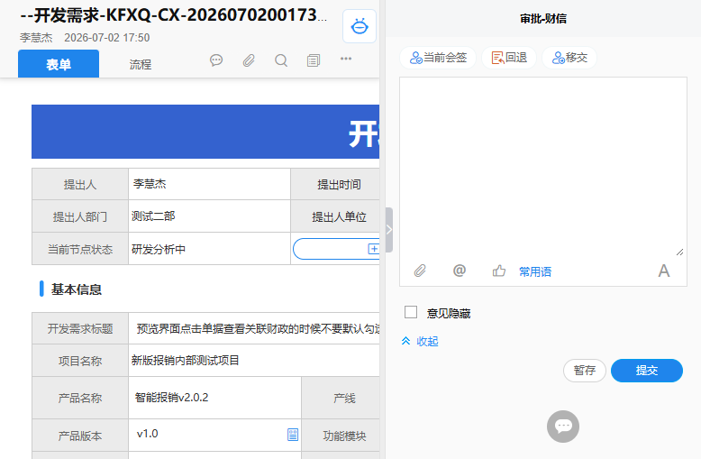

# Seeyon A8+ 待办详情页面详细分析文档

## 1. 页面概述

| 属性 | 值 |
|------|-----|
| 页面名称 | 开发需求单详情页 |
| 访问URL | `http://120.35.0.67:28101/seeyon/collaboration/collaboration.do?method=summary&openFrom=listPending&affairId=4617337309060546578&showTab=true` |
| 需求标题 | 预览界面点击单据查看关联财政的时候不要默认勾选仅查看有余额的指标这个选项 |
| 需求编号 | KFXQ-CX-2026070200173 |
| 所属项目 | 新版报销内部测试项目 |
| 当前节点 | 研发负责人处理 |
| 当前审批人 | 黄习恒 |

---

## 2. 页面整体布局

### 2.1 布局架构

页面采用 **左右分栏布局** 结构：

```
┌─────────────────────────────────────────────────────────────────────────┐
│                        顶部导航栏                                       │
│  [返回意见区] [返回顶部]                                               │
├─────────────────────────────────────────────────────────────────────────┤
│                          主体区域                                       │
│  ┌─────────────────────────────────────┬─────────────────────────────┐  │
│  │         左侧：表单内容区             │         右侧：处理意见区      │  │
│  │                                     │                             │  │
│  │  ┌─────────────────────────────┐    │  ┌───────────────────────┐  │  │
│  │  │ 流程助手 / 相关数据 / 智能校验 │    │  │ 当前会签 / 回退 / 移交 │  │  │
│  │  ├─────────────────────────────┤    │  ├───────────────────────┤  │  │
│  │  │ 表单Tab（表单/流程）         │    │  │ 处理意见输入框         │  │  │
│  │  ├─────────────────────────────┤    │  │                       │  │  │
│  │  │ 开发需求单表单内容           │    │  │ 附件上传               │  │  │
│  │  │ （在iframe中渲染）          │    │  │ 常用语                 │  │  │
│  │  └─────────────────────────────┘    │  ├───────────────────────┤  │  │
│  │                                     │  │ 提交 / 暂存按钮        │  │  │
│  │                                     │  └───────────────────────┘  │  │
│  └─────────────────────────────────────┴─────────────────────────────┘  │
└─────────────────────────────────────────────────────────────────────────┘
```

### 2.2 页面截图



---

## 3. 左侧表单内容区分析

### 3.1 流程助手工具栏

位于页面左侧顶部，包含以下功能按钮：

| 按钮名称 | 图标 | 功能描述 | 调用函数 |
|----------|------|----------|----------|
| 流程助手 | sy-processAssistant | 显示流程相关帮助信息 | `guanlianFun(this)` |
| 查看流程说明书 | sy-processBook | 查看流程设计文档 | `processBookFun(this)` |
| 相关数据 | sy-dataRelationLink | 显示关联数据 | `guanlianFun(this)` |
| 流程预测 | sy-predict-process | 预测流程后续节点和耗时 | `_executePrediction(this)` |
| 智能校验 | sy-simulation | 智能校验表单数据 | `showIntelligentCheck(this)` |
| 关闭 | sy-close | 关闭流程助手面板 | `_executeCloseDataRelation(this)` |

### 3.2 表单Tab页

| Tab名称 | 功能描述 |
|----------|----------|
| 表单 | 显示开发需求单的详细表单内容（在iframe中渲染） |
| 流程 | 显示审批流程历史和进度 |

### 3.3 开发需求单表单字段

表单内容在iframe中渲染，包含以下字段：

#### 3.3.1 基本信息

| 字段名称 | 值 |
|----------|-----|
| 表单类型 | 开发需求单 |
| 需求编号 | KFXQ-CX-2026070200173 |
| 提出人 | 李慧杰 |
| 提出时间 | 2026-07-02 17:44 |
| 提出人部门 | 测试二部 |
| 提出人单位 | 北京博思财信网络科技有限公司 |
| 提出人手机号 | 15648351225 |
| 当前节点状态 | 研发分析中 |
| 来源单号 | QXWT-CX-2026031600152 |

#### 3.3.2 需求信息

| 字段名称 | 值 |
|----------|-----|
| 开发需求标题 | 预览界面点击单据查看关联财政的时候不要默认勾选仅查看有余额的指标这个选项 |
| 项目名称 | 新版报销内部测试项目 |
| 产品名称 | 智能报销v2.0.2 |
| 产线 | 财信产品 |
| 二级产线 | 内控管理一体化系统（行政事业单位及高校） |
| 产品版本 | v1.0 |
| 功能模块 | 智能报销v2.0.2 |
| 菜单 | 查看单据 |
| 紧急程度 | 高 |
| 需求类型 | 新需求类 |
| 是否产品经理分析 | 是 |

#### 3.3.3 处理信息

| 字段名称 | 值 |
|----------|-----|
| 处理意见 | （空） |
| 不改原因 | （空） |
| 需求负责人 | （空） |
| 需求类别 | （空） |
| 需求解决方案 | （空） |
| 开发人员 | （空） |
| 希望完成时间 | 2026-07-15 |
| 计划完成时间 | （空） |
| 验证结果 | （空） |
| 测试人 | 李慧杰、伍思语、曹友强 |
| 需求等级 | 请填写需求等级 |
| 开发备注 | 请填写缺陷引出人、引出日期及其他备注 |

#### 3.3.4 需求描述

| 字段名称 | 值 |
|----------|-----|
| 需求场景描述 | 预览界面点击单据查看关联财政的时候不要默认勾选仅查看有余额的指标这个选项 |
| 纳入几月任务计划 | （空） |
| 需求详细描述 | 预览界面点击单据查看关联财政的时候不要默认勾选仅查看有余额的指标这个选项 |
| 方案描述 | （空） |
| 附件 | image.png (132KB), image.png (486KB) |

---

## 4. 右侧处理意见区分析

### 4.1 操作工具栏

| 按钮名称 | 图标 | 颜色 | 功能描述 |
|----------|------|------|----------|
| 当前会签 | sy-current_countersigned | #1f85ec（蓝色） | 与其他审批人同时审批 |
| 回退 | sy-toback | #d4642b（橙色） | 将流程回退到上一个节点 |
| 移交 | sy-transfer | #1f85ec（蓝色） | 将审批任务移交给其他人 |

### 4.2 处理意见输入区

#### 4.2.1 富文本编辑器

| 属性 | 值 |
|------|-----|
| 控件类型 | CKEditor富文本编辑器 |
| 高度 | 195px |
| 工具栏配置 | VerySimple（简化工具栏） |
| 字体大小 | 14px |

#### 4.2.2 工具栏功能

| 按钮 | 图标 | 功能描述 |
|------|------|----------|
| 上传附件 | sy-attachment | 上传本地文件 |
| @提及 | sy-at | @提及其他人员 |
| 赞 | sy-praise | 点赞当前待办 |
| 常用语 | - | 插入常用审批语 |
| 意见编辑 | sy-editor | 切换编辑器模式 |

#### 4.2.3 附件上传

| 属性 | 值 |
|------|-----|
| 上传方式 | 拖拽上传 + 点击上传 |
| 支持多文件 | 是（multiple="multiple"） |
| 附件区域 | attachmentArea（最大高度192px） |
| 关联文档 | attachment2Area（最大高度96px） |

### 4.3 意见隐藏选项

| 选项 | 说明 |
|------|------|
| 意见隐藏 | 勾选后，处理意见对后续审批人隐藏 |
| 不包括 | 指定意见对哪些人可见 |

### 4.4 底部操作按钮

| 按钮名称 | 样式 | 功能描述 | 调用函数 |
|----------|------|----------|----------|
| 提交 | common_button_emphasize（蓝色强调） | 提交审批意见，流程继续流转 | `submitClickFunc()` |
| 暂存 | common_button（普通灰色） | 保存当前意见但不提交，下次可继续编辑 | `toolbaroperation_btn_3_aClick(this)` |

---

## 5. 关键JavaScript函数分析

### 5.1 流程助手函数

| 函数名 | 功能描述 |
|--------|----------|
| `guanlianFun(obj)` | 显示流程助手或相关数据面板 |
| `processBookFun(obj)` | 查看流程说明书 |
| `_executePrediction(obj)` | 执行流程预测 |
| `showIntelligentCheck(obj)` | 显示智能校验结果 |
| `_executeCloseDataRelation(obj)` | 关闭数据关联面板 |
| `loadAndRefreshPrediction(config)` | 加载并刷新流程预测数据 |
| `_renderPredictionData(predictionProcessVO, container, startTime)` | 渲染流程预测结果 |

### 5.2 审批操作函数

| 函数名 | 功能描述 |
|--------|----------|
| `submitClickFunc()` | 提交审批意见 |
| `toolbaroperation_btn_0_aClick(obj)` | 当前会签操作 |
| `toolbaroperation_btn_1_aClick(obj)` | 回退操作 |
| `toolbaroperation_btn_2_aClick(obj)` | 移交操作 |
| `toolbaroperation_btn_3_aClick(obj)` | 暂存操作 |
| `showAtSelectWin()` | 显示@提及人员选择窗口 |
| `praiseToSummary()` | 点赞当前待办 |
| `initEditorAndShow(id)` | 初始化并显示编辑器 |
| `showHideFunc()` | 展开/收起处理意见区 |
| `hiddenSideFunc()` | 隐藏/显示右侧处理意见区 |

### 5.3 督办函数

| 函数名 | 功能描述 |
|--------|----------|
| `openSuperviseWindow(superviseType, isSubmit, moduleId, templateId, callBack, startMemberId)` | 打开督办设置窗口 |
| `showSuperviseWindow(summaryId, app, finished, templeteId)` | 显示督办窗口 |

### 5.4 页面生命周期函数

| 函数名 | 功能描述 |
|--------|----------|
| `_leavePage(affairId)` | 离开页面时触发，清理资源 |
| `initHasContent()` | 初始化内容状态 |

---

## 6. 后端API端点汇总

### 6.1 协同审批接口

| API路径 | HTTP方法 | 功能描述 |
|---------|----------|----------|
| `/seeyon/collaboration/collaboration.do?method=summary` | GET | 获取待办详情 |
| `/seeyon/collaboration/collaboration.do?method=tabOffice` | GET | 获取正文内容 |
| `/seeyon/collaboration/collaboration.do?method=deal` | POST | 提交审批意见 |

### 6.2 流程预测接口

| API路径 | HTTP方法 | 功能描述 |
|---------|----------|----------|
| `/seeyon/workflowPrediction.do?method=prediction` | GET/POST | 执行流程预测 |

### 6.3 文件上传接口

| API路径 | HTTP方法 | 功能描述 |
|---------|----------|----------|
| `/seeyon/fileUpload.do` | POST | 上传附件 |
| `/seeyon/fileUpload.do?method=showRTE` | GET | 显示图片/文件 |

### 6.4 督办接口

| API路径 | HTTP方法 | 功能描述 |
|---------|----------|----------|
| `/seeyon/supervise/supervise.do?method=openSuperviseWindow` | GET | 打开督办设置窗口 |
| `/seeyon/supervise/supervise.do?method=saveOrUpdateSupervise` | POST | 保存或更新督办设置 |
| `/seeyon/supervise/supervise.do?method=superviseDialog` | GET | 显示督办对话框 |

### 6.5 表单接口

| API路径 | HTTP方法 | 功能描述 |
|---------|----------|----------|
| `/seeyon/common/cap-dynamic-front/load.js` | GET | 加载动态表单组件 |
| `/seeyon/cap4/businessTemplateController.do?method=capUnflowList` | GET | 获取业务表单列表 |

---

## 7. 关键页面变量

### 7.1 协同基本信息

| 变量名 | 值 | 说明 |
|--------|-----|------|
| `summaryId` | 5564738987327504692 | 协同摘要ID |
| `affairId` | 4617337309060546578 | 事务ID |
| `subject` | --开发需求-KFXQ-CX-2026070200173-... | 主题 |
| `formAppId` | 5907750365354871990 | 表单应用ID |
| `formRecordid` | 2161548997499766748 | 表单记录ID |
| `viewId` | 8340370883002452104 | 视图ID |

### 7.2 流程信息

| 变量名 | 值 | 说明 |
|--------|-----|------|
| `_summaryProcessId` | 6187292868810196682 | 流程实例ID |
| `_summaryActivityId` | 17086789445303 | 当前活动ID |
| `_summaryCaseId` | -4395844875674235400 | 流程实例Case ID |
| `_summaryItemId` | -762280889498448625 | 工作项ID |
| `templateWorkflowId` | 631658005678212045 | 流程模板ID |
| `nodeName` | 研发负责人处理 | 当前节点名称 |
| `nodePolicy` | 审批-财信 | 当前节点策略 |

### 7.3 用户信息

| 变量名 | 值 | 说明 |
|--------|-----|------|
| `_currentUserId` | 9107420564351240468 | 当前用户ID |
| `_currentUserName` | 黄习恒 | 当前用户名 |
| `senderId` | -5548822425607910510 | 发起人ID |
| `_startMemberId` | -5548822425607910510 | 发起人ID |
| `affairMemberName` | 黄习恒 | 待办所属人 |

### 7.4 权限配置

| 变量名 | 值 | 说明 |
|--------|-----|------|
| `nodePerm_baseActionList` | ["ContinueSubmit","3463829911435037253","Opinion","CommonPhrase","UploadAttachment"] | 基础操作权限 |
| `nodePerm_commonActionList` | ["JointSign","Return","Transfer"] | 普通操作权限 |
| `nodePerm_advanceActionList` | [] | 高级操作权限 |
| `summaryReadOnly` | false | 是否只读 |
| `canEdit` | false | 是否可编辑 |

---

## 8. 页面架构与加载机制

### 8.1 表单渲染架构

页面采用 **iframe嵌套架构**，表单内容在独立iframe中渲染：

```
主页面 (collaboration.do?method=summary)
        ↓
┌─────────────────────────────────────┐
│  流程助手工具栏（主页面）            │
├─────────────────────────────────────┤
│  Tab切换（表单/流程）               │
├─────────────────────────────────────┤
│  <iframe> - 表单内容区              │
│    ↓                               │
│  动态表单组件 (cap-dynamic-front)   │
│  开发需求单表单渲染                 │
│  附件显示                          │
│  所见即所得编辑器                  │
└─────────────────────────────────────┘
```

### 8.2 处理意见提交流程

```
用户填写处理意见
        ↓
点击"提交"按钮
        ↓
submitClickFunc()
        ↓
表单校验（检查必填字段）
        ↓
收集意见内容、附件、隐藏选项
        ↓
POST到 /seeyon/collaboration/collaboration.do?method=deal
        ↓
服务器处理审批意见
        ↓
流程流转到下一个节点
        ↓
刷新页面或跳转
```

### 8.3 流程预测功能

```
点击"流程预测"按钮
        ↓
_executePrediction()
        ↓
loadAndRefreshPrediction()
        ↓
callBackendMethod("workflowPredictionManager", "doPrediction", params)
        ↓
后端执行流程模拟和大数据分析
        ↓
返回预测结果（未完成节点数、预计耗时、预计完成时间）
        ↓
_renderPredictionData() 使用laytpl模板渲染结果
        ↓
显示预测结果面板
```

---

## 9. 技术栈分析

### 9.1 前端框架与库

| 技术 | 用途 |
|------|------|
| jQuery | DOM操作、AJAX请求 |
| CKEditor | 富文本编辑器 |
| laytpl | 模板引擎（用于流程预测结果渲染） |
| ctpUi | UI组件库 |
| syIconfont | 图标字体库 |
| cap-dynamic-front | 动态表单组件框架 |

### 9.2 核心模块

| 模块 | 功能描述 |
|------|----------|
| `$.content` | 正文内容管理 |
| `$.dialog` | 弹窗组件 |
| `$.PeopleCard` | 人员卡片组件 |
| `$.i18n` | 国际化翻译 |
| `callBackendMethod` | 后端方法调用封装 |

---

## 10. 关联文档

### 10.1 登录页面分析

[Seeyon_A8_Login_Page_Analysis.md](Seeyon_A8_Login_Page_Analysis.md)

### 10.2 主应用页面分析

[Seeyon_A8_Main_Page_Analysis.md](Seeyon_A8_Main_Page_Analysis.md)

### 10.3 页面跳转流程

```
待办中心 → 点击待办事项标题
        ↓
checkAndOpenLink(url, openType, affairId, isTop, summaryId, obj)
        ↓
打开URL: /collaboration/collaboration.do?method=summary&affairId={affairId}
        ↓
加载待办详情页面
        ↓
用户填写处理意见 → 提交/暂存
        ↓
流程流转 → 返回待办中心或刷新页面
```

---

## 11. 总结

本待办详情页面是Seeyon A8+ V8.1SP2集团版的核心审批页面，具备以下特点：

1. **左右分栏布局**：左侧表单内容区，右侧处理意见区，布局清晰
2. **完整的审批功能**：提交、暂存、回退、移交、当前会签等操作
3. **流程预测能力**：基于流程模拟技术和行为大数据提供智能预测
4. **智能校验**：自动校验表单数据的完整性和正确性
5. **富文本编辑器**：支持格式化文本、附件上传、@提及人员
6. **动态表单渲染**：通过iframe和cap-dynamic-front框架渲染复杂业务表单
7. **督办功能**：支持对审批流程进行督办设置

页面设计兼顾了业务需求和用户体验，是一个典型的企业级OA系统审批页面。
