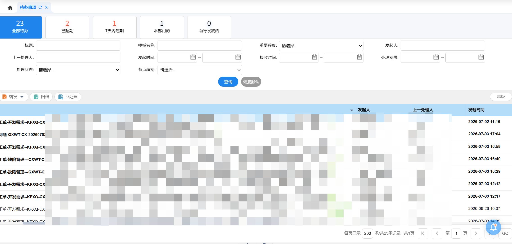

带参数查询待办事项列表




请求示例：

```js
fetch("http://120.35.0.67:28101/seeyon/ajax.do?method=ajaxAction&managerName=colManager&rnd=65446", {
  "headers": {
    "accept": "*/*",
    "accept-language": "zh-CN,zh;q=0.9",
    "content-type": "application/x-www-form-urlencoded;charset=UTF-8",
    "requesttype": "AJAX",
    "cookie": "ts=1783070424261; JSESSIONID=ADCF69176A333CE4C3976AFD7DF0095F; login_locale=zh_CN; avatarImageUrl=9107420564351240468; loginPageURL="
  },
  "body": "managerMethod=getPendingList&arguments=%5B%7B%22page%22%3A1%2C%22size%22%3A%22200%22%7D%2C%7B%22subject%22%3A%22%22%2C%22importantLevel%22%3A%22%22%2C%22createDate%22%3A%22%22%2C%22templateName%22%3A%22%22%2C%22deduplication%22%3A%22false%22%2C%22aiProcessing%22%3A%22false%22%2C%22startMemberName%22%3A%22%22%2C%22preApproverName%22%3A%22%22%2C%22receiveDate%22%3A%22%22%2C%22expectprocesstime%22%3A%22%22%2C%22subState%22%3A%22%22%2C%22isOverdue%22%3A%22%22%7D%5D",
  "method": "POST"
});
```

响应示例：

```json
{
    "total": 2,
    "pages": 1,
    "data": [
        {
            "affairId": "-2099476618888523868",
            "subject": "运维工单-开发需求--KFXQ-CX-2026070200058--项目：贵州电子科技职业学院智慧财务平台实施项目-住宿费多人金额拆分填报及单据打印优化-产品：智能报销v2.0.2-支持人员：{支持人员确认}",
            "startMemberName": "李高忠(博思软件)",
            "startDate": "2026-07-02 11:16",
            "createDate": "2026-07-02 11:16",
            "finishDate": null,
            "receiveTime": "2026-07-03 17:25",
            "nodeDeadLineName": "无",
            "hastenTimes": 0,
            "subState": 7,
            "processId": "-1603308466236341170",
            "summaryId": "-7513978466726032881",
            "isCoverTime": false,
            "processIsCoverTime": false,
            "deadLineDate": "0",
            "state": 0,
            "bodyType": "20",
            "hasAttsFlag": false,
            "superNode": false,
            "importantLevel": 1,
            "proxy": false,
            "subStateName": "被回退",
            "processDeadLineName": "无",
            "processDeadline": null,
            "isTrack": false,
            "trackType": 0,
            "showAuthorityButton": false,
            "startMemberId": "7669215345208477809",
            "dealTime": null,
            "orgAccountId": "-3914150528107787509",
            "newflowType": 0,
            "advanceRemind": null,
            "flowFinished": false,
            "templeteId": "2146362288171993991",
            "caseId": "-2704599184174658785",
            "canDeleteORarchive": false,
            "workitemId": "-1412429142394912085",
            "activityId": "170973689752708",
            "currentNodesInfo": "",
            "backFromId": "8737565458796011866",
            "hasFavorite": false,
            "canForward": false,
            "replyCounts": null,
            "fromId": null,
            "expectedProcessTime": null,
            "nodeName": "审批-财信",
            "affairState": 3,
            "preApproverName": "傅新民",
            "summaryState": 0,
            "formAppId": "5907750365354871990",
            "formViewOperation": "-1179940159302447851",
            "formRecordid": "2926066336330892413",
            "canReMove": true,
            "affairArchiveId": null,
            "print": 0,
            "hasPrint": "否",
            "readState": 0,
            "memberId": "9107420564351240468",
            "affairNodeName": "研发负责人处理—需求",
            "secretName": null,
            "parentformSummaryid": null,
            "cancelOpinionPolicy": 0,
            "disAgreeOpinionPolicy": 0,
            "canEdit": false,
            "grab": false
        },
        {
            "affairId": "8935365803985027143",
            "subject": "缺陷问题-QXWT-CX-2026070300153-广东行政职业学院银校通(二期)实施项目-广东行政职业学院-升级530包后报销单字段异常",
            "startMemberName": "田顺",
            "startDate": "2026-07-03 17:04",
            "createDate": "2026-07-03 17:04",
            "finishDate": null,
            "receiveTime": "2026-07-03 17:04",
            "nodeDeadLineName": "无",
            "hastenTimes": 0,
            "subState": 11,
            "processId": "-2736069545443375187",
            "summaryId": "-5445078254533718469",
            "isCoverTime": false,
            "processIsCoverTime": false,
            "deadLineDate": "0",
            "state": 0,
            "bodyType": "20",
            "hasAttsFlag": false,
            "superNode": false,
            "importantLevel": 1,
            "proxy": false,
            "subStateName": "未读",
            "processDeadLineName": "无",
            "processDeadline": null,
            "isTrack": false,
            "trackType": 0,
            "showAuthorityButton": false,
            "startMemberId": "8754191296763066474",
            "dealTime": null,
            "orgAccountId": "-4893673625999095312",
            "newflowType": 0,
            "advanceRemind": null,
            "flowFinished": false,
            "templeteId": "505479739135378210",
            "caseId": "7667008495377730531",
            "canDeleteORarchive": false,
            "workitemId": "-7458416202684084876",
            "activityId": "17086781833543",
            "currentNodesInfo": "",
            "backFromId": null,
            "hasFavorite": false,
            "canForward": false,
            "replyCounts": null,
            "fromId": null,
            "expectedProcessTime": null,
            "nodeName": "审批-财信",
            "affairState": 3,
            "preApproverName": "田顺",
            "summaryState": 0,
            "formAppId": "5907750365354871990",
            "formViewOperation": "-7461107136176370635",
            "formRecordid": "2655522199627975039",
            "canReMove": true,
            "affairArchiveId": null,
            "print": 0,
            "hasPrint": "否",
            "readState": 0,
            "memberId": "9107420564351240468",
            "affairNodeName": "研发负责人处理",
            "secretName": null,
            "parentformSummaryid": null,
            "cancelOpinionPolicy": 0,
            "disAgreeOpinionPolicy": 0,
            "canEdit": false,
            "grab": false
        }
    ],
    "size": 200,
    "showTotal": true,
    "page": 1
}
```
